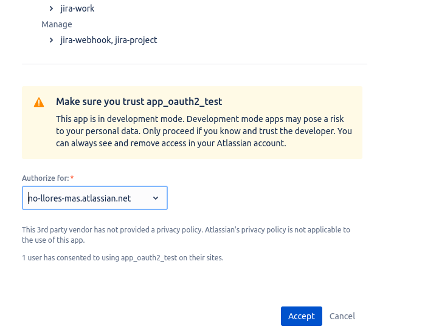

# Jira API

* For working with webhooks, only "OAuth2" type of authentication may be used; otherwise any webhook-related API will throw an exception
* obtain OAuth2 access_token; usually it'll be valid within 1 hour (3600 seconds)
* for the `host` value in `.env` use `https://api.atlassian.com/ex/jira/{your_cloud_id}`
* for OAuth2 applications, only 5 active webhooks are allowed per tenant

## How to obain OAuth2 access token

...in order to be able to make API calls to webhook API of Jira.

#### steps

* (1) create a test application at Jira

* (2) create a local application in any language which will be used to catch OAuth2 access_token; for simplicity use Python

* (3) in order to expose an application from (2), one may want to use ngrok

* (4) specify `callback_url` which points to a special route which (2) must contain

* (5) fill it the value in this url: `https://auth.atlassian.com/authorize?audience=api.atlassian.com&client_id={CLIENT_ID}&scope={SCOPE}&redirect_uri={REDIRECT_URL}jira_callback&state={STATE}&response_type=code&prompt=consent`

* (6) go to the url and press "Allow"

* (7) get the value of "access_token" in the application from (2)

## OAuth2 authentication page

## Usefull links

* https://developer.atlassian.com/cloud/jira/software/oauth-2-3lo-apps/
* https://developer.atlassian.com/console/myapps
* https://confluence.atlassian.com/adminjiraserver0822/jira-oauth-2-0-provider-api-1142237088.html
* https://support.atlassian.com/jira-cloud-administration/docs/manage-project-permissions/?permissionViolation=true

